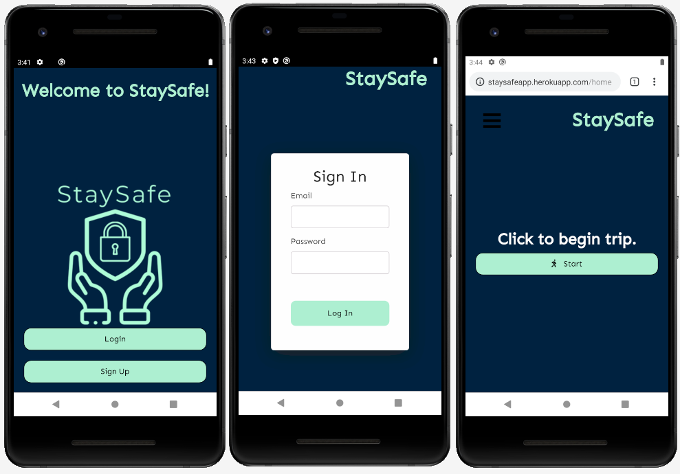
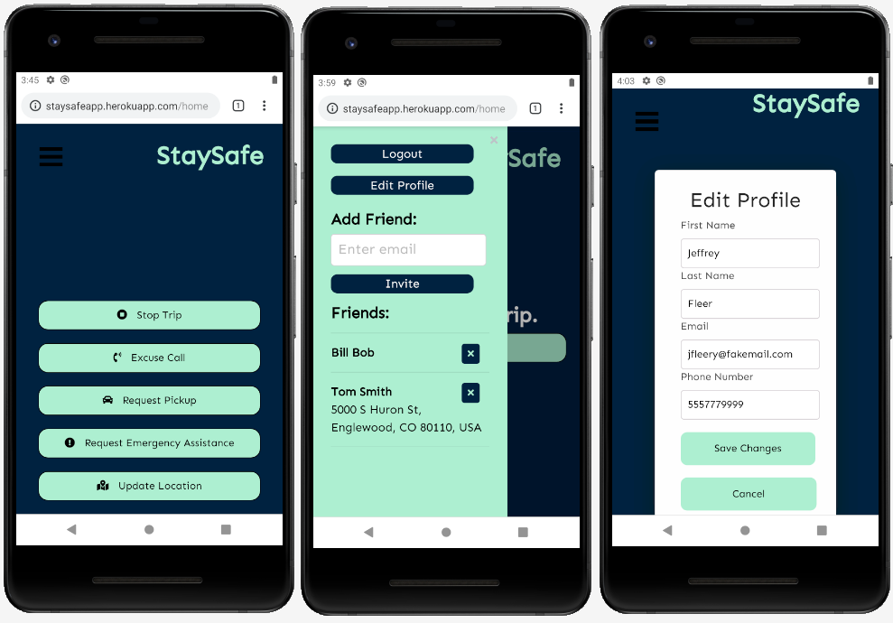

# StaySafe Wherever You Go
StaySafe is a browser based web application intended for use on mobile devices. Our application allows users to call for help on the go with ease, and keep tabs on their friends who are out and about.  

  
  

## Our Mission
Our plan for StaySafe was to design an application to help keep users safe in away from home scenarios, such as first dates, Craigslist encounters, or any potentially vulnerable or dangerous situation. The app allows users to update their location when on any kind of trip away from home. When a user begins a trip, a text message is sent to the user's friends notifying them the user's trip has begun. Friends of the user are able to view the user's last known location while they are on a trip by viewing their friends list. If anything goes wrong, the user can send out a text message to their friends list with the press of a button asking for either: an urgent phone call giving the user an excuse to leave, a request asking to be picked up at the user's current location, or a request asking emergency services to be contacted. The goal was for the app to be useful in a wide range of scenarios, allowing the user to call for help in a variety of ways with a single button press. The ease of use and powerful functionality of StaySafe is essential in a stressful situation.

## Demo The App
[Click Here](https://staysafe.best/) to view the application on heroku (mobile device preferred)

## Design
Our app features a mobile first design, with a color scheme that's pleasing to look at, while allowing for appropriate contrast. To maintain our philosophy surrounding ease of use and simplicity, most of the key functionality happens on the backend. Everything is easily accessible to the user, no digging through multiple front end components. While the app can certainly be used on a laptop or desktop computer, using a mobile device is strongly recommended for the situations in which this application is useful.

## Tools and Technologies
* HTML/CSS
* Javascript/ES6
* Node JS
* Express JS
* MongoDB
* Mongoose
* Passport JS
* Bcrypt
* Twilio
* Sendgrid
* Axios
* React
* React Router
* React Burger Menu
* MDB React
* Bootstrap
* History
* Helmet
* Google Reverse Geocoder
* Express-sslify
* Morgan
* Jest/Enzyme
* FontAwesome

## Contributors
* [Bradley Knutson](https://github.com/bradleyknutson)
* [Nathaniel Anderson](https://github.com/Nathaniel-DU)
* [Brittany Huber](https://github.com/bhuber23)
* [Nicholas Herrick](https://github.com/nicholasherrick)